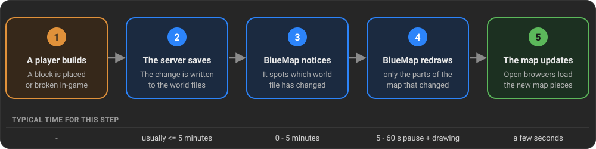
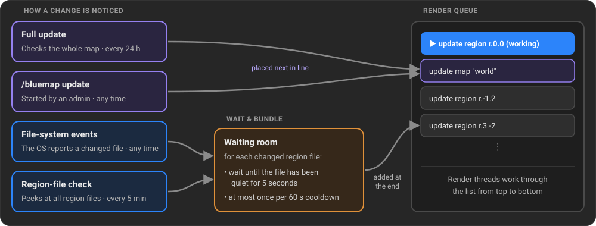
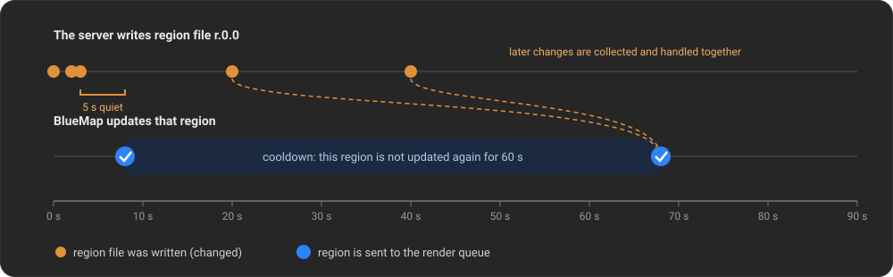
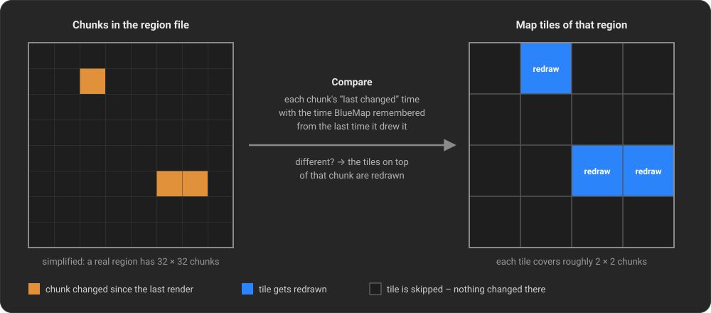
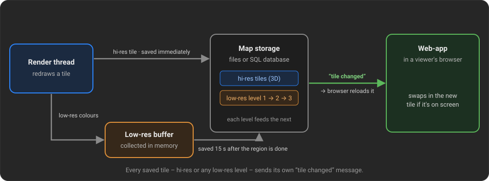

# How BlueMap keeps your maps up to date

Someone places a block on your server, and a little later it shows up on the web map. This page explains what
happens in between, why it isn't instant, and what you can adjust.

> **This applies to:** BlueMap running as a plugin or mod on a server (Paper, Spigot, Fabric, Forge, NeoForge,
> Sponge), and the standalone CLI started with the `-u` (watch) flag. The process is the same in all of them.
{: .info }

# The "short" version

1. **A player builds something.** For now the change only exists in the server's memory.
2. **The server saves.** Minecraft writes changes to the world files on disk from time to time (by default
   roughly every 5 minutes, and whenever an area gets unloaded because no player is near it anymore).
   **BlueMap reads the world files, not the running game.** Until the server saves, BlueMap can't see the change.
3. **BlueMap notices that a world file changed.** Usually the operating system tells it right away. As a backup,
   BlueMap also checks all world files itself every few minutes.
4. **BlueMap redraws only what changed.** It waits a few seconds in case more changes arrive, then works out which
   parts of the map are affected and redraws only those.
5. **The web map updates.** Anyone who has the map open gets a message that a piece of the map changed, and their
   browser loads the new version. No page reload is needed.

This usually takes **a few seconds to a few minutes**. Most of that time goes to waiting for the server to save.

## Why don't I see my change right away?

| Reason                                                                               | How long it can take                                | What you can do                                                               |
|--------------------------------------------------------------------------------------|-----------------------------------------------------|-------------------------------------------------------------------------------|
| The server hasn't saved the change to disk yet                                       | Up to ~5 minutes (depends on the server's autosave) | Run `/save-all flush`, or use `/bluemap update`, which saves first            |
| BlueMap waits for the area to stop changing                                          | 5 seconds, at most 60 seconds                       | Nothing needed. This keeps BlueMap from redrawing the same area over and over |
| BlueMap is busy with other work (e.g. a big render)                                  | Depends on the size of that work                    | Check progress with `/bluemap`                                                |
| Rendering is paused (too many players online, `/bluemap stop`, or the map is frozen) | Until it resumes                                    | See [Things that pause updates](#things-that-pause-or-stop-updates)           |
| Your browser can't receive live updates (e.g. a proxy blocks them)                   | Until you reload the page                           | Reload the page, or use **Update Map** in the web-app menu                    |
| Old map-tiles are cached somewhere (e.g. CloudFlare)                                 | Until the cache expires                             | Disable or clear the cache                                                    | 

# In detail

## Step 1 - The server saves the change

Minecraft stores a world in **region files** in the world's `region` folder. Each file is named like
`r.0.0.mca` and holds a 32 × 32 area of **chunks** (512 × 512 blocks). At the start of every region file is a small
table recording **when each chunk in it last changed**. BlueMap relies on this table heavily.

A running server keeps loaded chunks in memory and writes them to the region files, only...
- ...during its regular **autosave** (vanilla: every 5 minutes; Paper, Spigot and some mods let you change this),
- ...when a chunk is **unloaded** because no player is near it anymore,
- ...when an admin runs **`/save-all flush`**, or when the server shuts down.

BlueMap never looks inside the running game to see block changes. It **always reads the region files**. That's
why the standalone CLI can keep a map updated with no server running at all, and why a change is invisible to
BlueMap until the server has written it to disk.

The only exception is the **`/bluemap update`** command. Before it starts, it asks the server to save the world, so
all changes made up to that moment are included.

## Step 2 - BlueMap notices the change

For every map that isn't frozen, BlueMap runs an **update watcher**. A change can reach the render queue in four
ways:

### File-system events (instant)

BlueMap asks the operating system to report whenever a file in the world's `region` folder is created, modified
or deleted. When the server saves a region file, the OS reports it within moments, and BlueMap works out from the
file name (e.g. `r.3.-2.mca`) which region changed.

This is fast and costs almost nothing. It doesn't work everywhere, though. Network drives, some Docker volume
setups and some hosting providers deliver these events late or not at all. That's why there are backups.

### Region-file check (every 5 minutes)

Every few minutes BlueMap reads the small table at the start of every region file (the chunks' "last changed" times) and
builds a *fingerprint* from it. If a fingerprint differs from the last check, that region has changed. If a region
file disappeared, that counts as a change too.

This reads only the first 8 KB of each file, so it's cheap. It catches everything the file-system events missed,
at most a few minutes late.

- Setting: `region-file-check-interval` in `core.conf` (in minutes, default `5`, `0` disables it).
- For very large worlds (more than about 10,000 region files) you may want to raise the interval.

### Full update (every 24 hours)

As a last safety net, BlueMap regularly runs a **full update** of each map. Despite the name, it does **not**
redraw the whole map. It goes through every region, compares the chunks' "last changed" times (see
[Step 5](#step-5---figuring-out-what-actually-changed)), and redraws only what changed. On a map that's already up to
date this finishes quickly.

A full update also cleans up areas that were **deleted** from the world (for example a trimmed region file).

- Setting: `full-update-interval` in `core.conf` (in minutes, default `1440` = 24 hours, `0` disables it).
- On a server, BlueMap remembers when the last full update happened, even across restarts. If one is due when
  BlueMap starts, it runs right away.

### Manual: `/bluemap update`

Admins can start an update at any time:

- `/bluemap update [map] [x z] [radius]` updates only what changed (saves the world first, as described above).
- `/bluemap fix-edges …` also redraws tiles at the edge of the map's render boundaries.
- `/bluemap force-update …` redraws **everything** in the chosen area, changed or not.

## Step 3 - Waiting and bundling

The server rarely saves a region file just once. During an autosave the same file can be written several times in
a row, and a busy build area gets saved again and again. Redrawing after every single write would waste a lot of
work. So changes noticed by file-system events and the region-file check go through a **waiting room** first:

- **Wait for quiet:** BlueMap waits until a region file has had **no new changes for 5 seconds**. Every new change
  restarts that timer.
- **Cooldown:** After a region has been sent for an update, it isn't sent again for **60 seconds**. Changes during
  that time aren't lost. They're collected and handled together once the cooldown ends.

Setting: `update-cooldown` in `core.conf` (in seconds, default `60`). The 5-second wait is fixed.

Each region is handled on its own. If players are building in two places, both regions get updated independently.

## Step 4 - The render queue

Everything BlueMap has to draw goes into a single **render queue**, a to-do list shared by all maps.

- The **render threads** (setting `render-thread-count` in `core.conf`) always work on the **first** task in the list
  together, and move on to the next one when it's done.
- Region updates from the waiting room are added **at the end** of the list.
- Full updates and `/bluemap update` commands are placed **next in line**, right after the task currently being
  worked on.
- The queue avoids doing work twice. A task that's already waiting isn't added again, and if a bigger task (like a
  full map update) already covers a region, that region isn't queued separately.
- The progress of the current task can be checked with `/bluemap`.
- You can view the render queue with `/bluemap tasks`.

On a server, the queue is saved to `tasks.dat` in BlueMap's data folder every 10 minutes and on shutdown. After a
restart BlueMap continues where it left off.

### Things that pause or stop updates

| What                                   | Effect                                                                                                                                                   |
|----------------------------------------|----------------------------------------------------------------------------------------------------------------------------------------------------------|
| `player-render-limit` in `plugin.conf` | While this many players (or more) are online, the render threads pause. Changes are still noticed and queued, and get drawn once the player count drops. |
| `/bluemap stop` / `/bluemap start`     | Pauses / resumes the render threads. Nothing gets drawn while stopped.                                                                                   |
| `/bluemap freeze <map>`                | Stops the update watcher of that map completely. Changes to that map are no longer noticed until `/bluemap unfreeze <map>`.                              |

## Step 5 - Figuring out what actually changed

A region update doesn't redraw the whole region. The map is drawn in small square **tiles** (the detailed 3D
"hi-res" tiles are 32 × 32 blocks, so each covers roughly 2 × 2 chunks). BlueMap redraws only the tiles on top of
chunks that actually changed since the last time it drew them:

1. BlueMap reads each chunk's "last changed" time from the region file's table.
2. It compares them with the "last changed" times it **remembered** from the last time it drew those chunks. BlueMap keeps
   this record for every map, alongside the map data.
3. Every tile that touches at least one changed chunk is marked for redrawing. All other tiles are skipped.

Each tile also keeps a **state**, which decides what to do with it:

- A normally **rendered** tile is redrawn only if one of its chunks changed.
- A tile that is now **outside the map's render boundaries** (e.g. you shrank `min-x`/`max-x` in the map config) is
  **deleted** from the map.
- A tile that was skipped earlier because its chunks weren't **fully generated**, were **missing light data**, or
  hadn't been visited long enough (`min-inhabited-time`) is checked again as soon as one of its chunks changes.
- A tile that **failed to render** last time is retried on the next update.

If a region file was **deleted**, all its chunks count as changed and "not generated", so the tiles in that area are
removed from the map.

When the region is done, BlueMap records the new "last changed" times of the chunks so the next update can compare against them.

## Step 6 - Storing the result

Every redrawn tile produces two kinds of output, which are stored differently:

- **Hi-res tiles** (the detailed 3D view you see up close) are written to the map's storage **immediately** after
  each tile is drawn.
- **Low-res tiles** (the flat, far-away view) cover a much larger area, so one low-res tile is affected by many
  hi-res tiles. BlueMap collects these changes in memory. When a region is done, BlueMap schedules a save
  **15 seconds later**. Other regions that finish in the meantime are included in that same save, so a busy map
  is still saved at most once every 15 seconds. There are several low-res levels (3 by default). Saving one level
  also updates the next, coarser one.

The storage can be plain files (the default) or an SQL database. The update process works the same either way.

## Step 7 - Getting the update to the viewers

When the web-app opens a map, it opens a **live connection** to BlueMap's built-in webserver (using a web
technology called *Server-Sent Events*, or SSE). The same connection also delivers live player positions and
marker changes.

Every time a tile is saved (hi-res or any low-res level), BlueMap sends a short **"tile changed"** message to every
connected browser. If that browser currently has the tile loaded, it downloads the new version and swaps it in.
Tiles that aren't on screen are ignored and get loaded fresh when the viewer moves there.

So viewers see **hi-res changes a moment after each tile is drawn**, and low-res changes about
15 seconds after the region is done (see Step 6).

- Setting: `sse-enabled` in `webserver.conf` (default `true`).
- If you put BlueMap behind a **reverse proxy** (nginx, Apache, Cloudflare, …), make sure it doesn't buffer or cache
  the `…/live/sse` URL. Otherwise the messages arrive late or never. BlueMap sends the `X-Accel-Buffering: no`
  header, which nginx follows automatically.

### When live updates aren't available

The live connection only works if the web-app is served by the same BlueMap that renders the map. Viewers **don't**
get automatic tile updates when:

- `sse-enabled` is turned off,
- a proxy blocks or buffers the live connection,
- the web-app is hosted by a **separate web server** (e.g. nginx serving the files directly), or by a CLI webserver
  (`-w`) running in a different process than the rendering (`-u`).

In these cases the map on disk is still updated as described above. Viewers just need to fetch it again, either by
**reloading the page** or by clicking **Update Map** in the web-app menu. Both make the browser check every tile for
a newer version instead of using its cache.

# Settings summary

| Setting                      | File             | Default          | What it does                                                   |
|------------------------------|------------------|------------------|----------------------------------------------------------------|
| `update-cooldown`            | `core.conf`      | `60` (seconds)   | Minimum time between two updates of the same region            |
| `region-file-check-interval` | `core.conf`      | `5` (minutes)    | How often all region files are checked for changes (`0` = off) |
| `full-update-interval`       | `core.conf`      | `1440` (minutes) | How often a full update runs (`0` = off)                       |
| `render-thread-count`        | `core.conf`      | `1`              | How many threads draw map tiles                                |
| `player-render-limit`        | `plugin.conf`    | `-1` (off)       | Pause rendering while this many players are online             |
| `sse-enabled`                | `webserver.conf` | `true`           | Push live tile, player and marker updates to browsers          |
